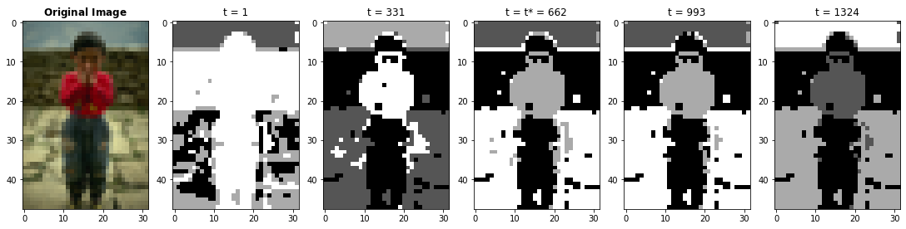

# Self-Diffusion on Graphs for Image Segmentation



This has been made as a homework of ITU - Graph Theory course. This repository provides these from-scratch implementations:

- Bellman-Ford Algorithm
- Global Efficiency, Diffusion Efficiency
- Graph Self-Diffusion

## Running the Analysis

You can run the notebook file to execute full analysis.

# Please cite this repository when using the content:

```latex
@misc{ozturk2021_selfdiff,
  author = {Anil Ozturk},
  title = {Self-Diffusion on Graphs for Image Segmentation},
  year = {2021},
  publisher = {GitHub},
  journal = {GitHub repository},
  howpublished = {\url{https://github.com/nlztrk/graph_self_diffusion}},
}
```